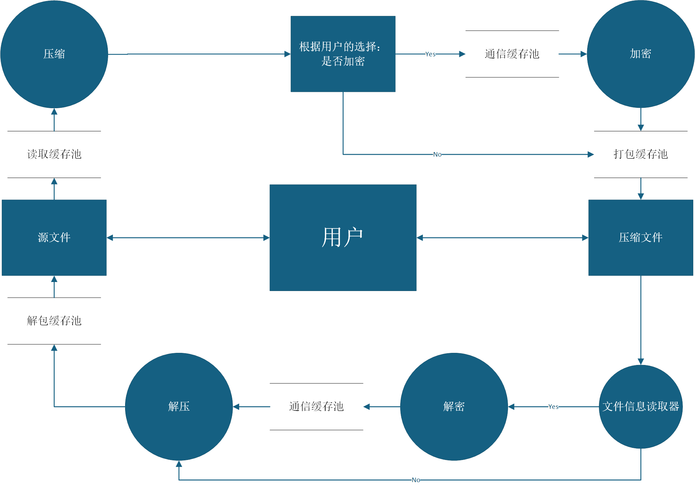
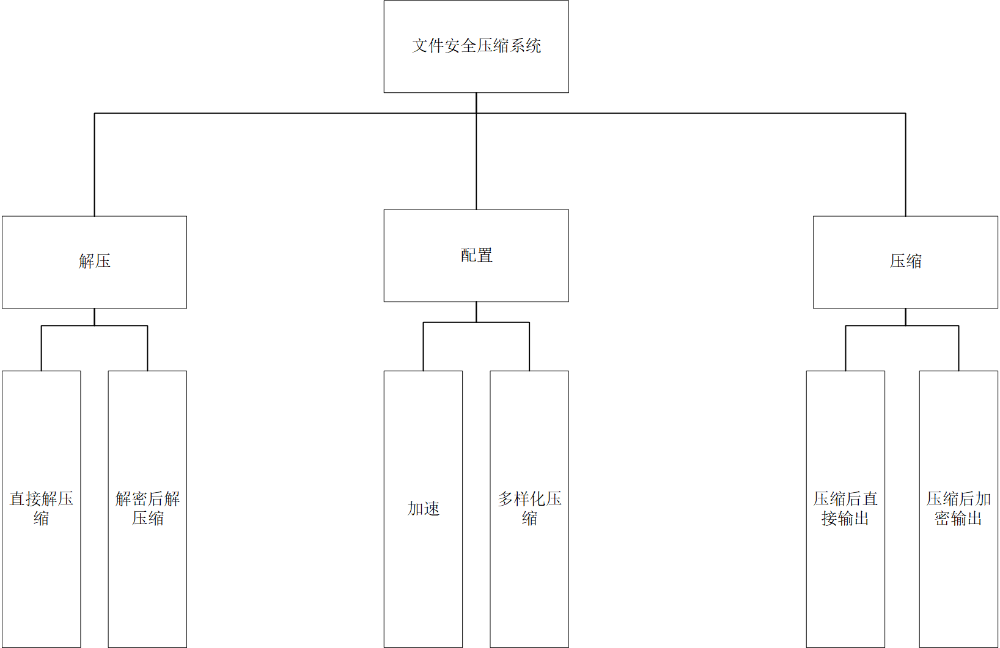
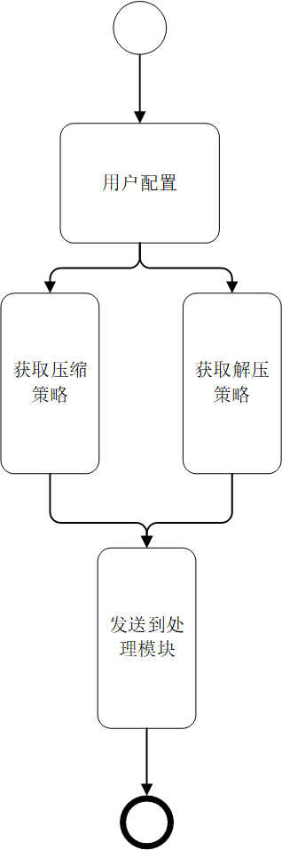
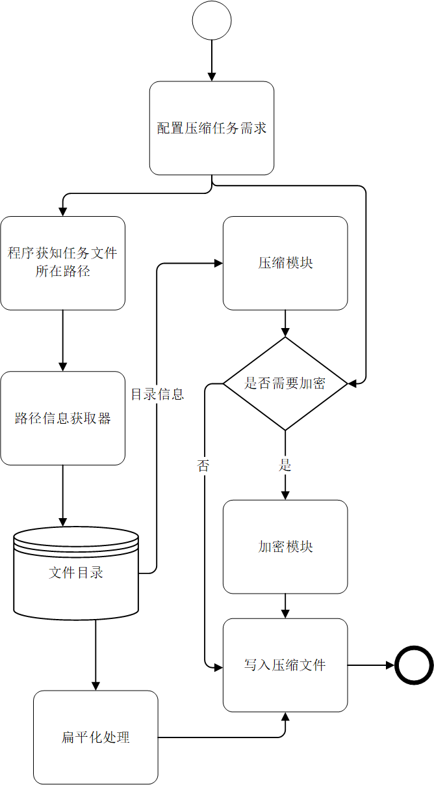
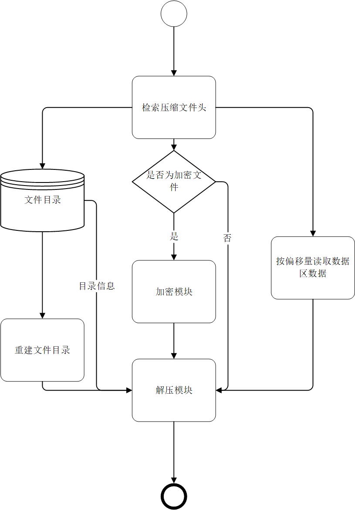

# 加密与压缩

## 目录
1. [用户视角的应用](#1-用户视角的应用)
2. [程序概览](#2-程序概览)
3. [程序结构初步设计](#3-程序结构初步设计)
   - [3.1 程序结构及要点](#31-程序结构及要点)
   - [3.2 初步设计](#32-初步设计)
4. [底层细节与技术](#4-底层细节与技术)
   - [4.1 技术整合与分析](#41-技术整合与分析)
   - [4.2 关键技术点](#42-关键技术点)
5. [算法具体实现](#5-算法具体实现)
   - [5.1 实现方案](#51-实现方案)
   - [5.2 疑难问题的解决方案](#52-疑难问题的解决方案)
   - [5.3 优化与改进](#53-优化与改进)
6. [安全问题](#6-安全问题)
   - [6.1 Aes的安全性问题](#61-aes的安全性问题)
   - [6.2 数据完整性问题](#62-数据完整性问题)
   - [6.3 系统安全考虑](#63-系统安全考虑)
7. [最终实现](#7-最终实现)
   - [7.1 程序的运行流程](#71-程序的运行流程)

## 1. 用户视角的应用
  >应用需要什么功能？  

我们需要尽可能给用户提供自由的压缩选项。  

【问题A1】  
是否需要加密？用什么算法加密？这在GUI界面中分别通过一个勾选器和列表选择器让用户操作。

【问题A2】  
在压缩时，可能需要处理多个文件一起压缩的情况。将多个文件整合成一个压缩包？所有文件分别独立成一个压缩包？或是在应用内可选择分类生成多个压缩包？需要提供一个选项供用户选择。

【问题A3】  
~~对于编码结构，用户可以选择是否将其独立成一个文件存放。~~（已不纳入考虑）

【问题A4】  
使用RSA加密可以实现特定用户间的数据加密传输。这时需要提供一个RSA密钥生成器。

【问题A4】  
可以选择从右键菜单栏中直接启动压缩任务。


## 2. 程序概览
  - 
  - **AES加密**：高级加密标准，高级加密标准对称性加密算法。
  - **RSA加密**：非对称性加密算法。（备选）
  - **流加密**：逐字节加密处理。（备选）
  - **Heffman编码**：基于前缀码的无损压缩算法。
  - **BWT编码**：基于后缀数组的压缩数据预处理算法。（备选）
  - **lz77**:使用滑动窗口建立三元组的压缩算法，可作为Huffman压缩的前置操作
  - **Qt**：c++的GUI框架，跨平台兼容。
  - **文件头**：包含压缩文件基本信息的数据结构。
  - **位图(bitmap)**：按位存储状态。
  - **信号与槽**：Qt框架的核心思想，响应式GUI编程。
  - **锁**：控制临界区的变量，持有锁的线程可以进入临界区。
  - **条件变量**：核心为休眠队列，通过信号唤醒队列中的线程。
  - **信号量**：类似Minecraft的红石比较器，或AE的发信器。控制进入临界区线程的数量。
  - **死锁**：多个线程争抢锁的形式构成单向环图的状况。造成线程永久的休眠。
  - **系统调用**：由操作系统提供给应用程序的接口。通常是受限操作，由操作系统执行。


## 3. 程序结构初步设计

### 3.1 程序结构及要点

**Compress/Decompress_System**  
  - 负责压缩与解压。  

**Encryption/Decryption_System**  
  - 负责加密与解密工作。

**BufferPool**  
  - 缓存以上两者的输出（通信缓存池、打包缓存池、解包缓存池）
  - 充当可接受线程管理器动态调度的对象
  - 每个线程组独立使用一个缓存池
  - 加入大小限制和溢出处理机制
  - 充当接收输入并缓存/主动抛出的作用

**ErrorCollector**  
  - 负责对错误的检测与收集，生成并且输出相关错误报告(日志)

### 3.2 初步设计
 
**Encryption**  
  技术点(适配技术)：
  1. 密钥hash处理
  2. 尾部补全与去除（aes需要内置）
  3. 缓存池

**Compression**  
  1. 继承一个缓存池接口，以二进制抛出数据块
  2. (待补充)
  3. (待补充)

**UnitManager**
  * 示意：Heffman-(1)>Aes-(2)>.sy文件(实际为二进制)
  * 虚拟接口类的设计：

**BufferPool**
- **依赖以下四种缓存方案实现程序的几乎所有数据流通：**
  1. 通信缓存池：压缩与加密端之间的通信。

  2. 打包缓存池：打包压缩单独输出、压缩加密输出（利用文件头区分。可能分别设计两类接口）

  3. 解包缓存池：直接由UnitManager控制目录的收发，打包时将目录存放到文件头，配合文件分割标志（是一个经过读取缓存池方法转换后，赋给数据块对象的变量的bool类型变量值）来用于此处的目录还原。

  4. 读取缓存池：读取目录并传输至打包缓存池。读取文件后：为压缩模块发送数据块、为解压模块发送数据。
  使用四个字节的滑动窗口动态检测魔数，遇到魔数则更改操作状态（要求魔数总是成对出现）
 

**文件：**
  1. 状态检测器：检测加密状态（Y/N）。监控文件压缩进度。
   
  2. 文件信息读取器：将文件的整个文件头读取到程序缓存中，并进行相关检查。监控文件解压进度。

  * 关于数据块类：
  ```
    vector<uint8_t> data    // 数据（二进制），可以先给定一个基础大小，避免频繁扩容
    uint32_t sequence_tag   // 顺序标签
    bool is_terminated      // 终止信号
    uint8_t header_flags    // 文件头标志位
    string source_tag       // 来源标签（如"COMPRESS", "AES"）
    string error_message    // 错误信息
  ```
- **偏移量记录方式和相关规则：**
  * 维护：在文件头中存储数据文件的文件名初始大小，解压时逐步递减，直至字节数不足。
  * 另外，需要在压缩时在一个临时文件内动态维护已压缩文件的大小，可以用于多文件下的heffman与aes的部分功能实现

- **关于文件头：**
  1. 
  - 记录文件头和数据块的偏移量

  - 记录压缩方案：加密方式/有无加密、压缩方式。

  2. 记录数据块偏移量：具体来说，这些数字应当是记录数据各个文件在'压缩文件数据区'的位置（利用文件指针能够继续读取的特性）。

  3. 在文件头记录文件的目录结构、偏移量：其中目录结构使用前缀索引（将会在前缀记录所有文件目录，其对应数据区存储包含文件后缀的文件名）、偏移量单独在文件名后存储（为每个节点预留2*8字节，分别存储文件压缩前后大小）

  4. 对于动态获取的偏移量的实时存储（接到结束信号后将压缩偏移量从缓冲区写入文件）。
    
    方案：读取文件目录之后直接在文件头中逐个处理对应文件（服务于数据偏移量更新），并且在预留好的位置修改压缩后大小。（不影响数据区写入数据。）
  ――至此，实现无临时文件的方案已经完善。

  5. 实现细则：

    - 1. 存储协议：|16bit文件名大小偏移量|文件名|文件标|----|
      - 文件标为0：为目录。需要写入：|16bit第一级文件数量|
      - 文件标为1：为文件。需要写入：|32bit原文件大小|32bit压缩大小|。其中压缩大小暂时作为占位区。

    - 2. 压缩前运行：
      - 0. 文件头开始与结束均需要写入魔数。

      - 1. 目录：读取后写入对应的存储协议，并且在缓冲区中缓存一个文件数量。

      - 2. 文件：读取后写入对应的存储协议

      - 3. 搜索方案：采用BFS。在上述0、1、2作为必要操作的条件下，搜索目录。

        I:
          - 如果搜索到文件：直接写入。
          - 如果搜索到目录：进入该目录并且仅记录其中第二级文件数量以及该目录的完整路径到队列备用。

        II:记录完数量后：返回，继续搜索第一级目录,重复操作I,直到第一级搜索完成，过程中不断记录第二级文件数量直至完成。

        III:写入队列中的目录数据，接着按照队列已存储的路径打开下一级目录，以先前获取的第二级文件数量及其所在目录的路径，按顺序读写对应的文件数据，直至文件数量耗尽为止。

        IV：重复上述操作直到读取完成。

        以上I~III解决了解压文件时如何按照顺序读取文件及其目录的问题。

        V:特别地，可以为所有目标文件提供一个逻辑根目录（同名或命名），以便始终遵循如上顺序读写数据。

    3. 解压时运行
    
    
    tips： 偏移量的读取和使用：
      - 使用<fstream>的tellg()、tellp() / seekg()、seekp()。
      具体来说：
        - 在接到该文件读取完成信号之后，需要在文件头对应的偏移占位上写入大小。
  
**GUI**  
  1. 多线程模式选择(后续自动检测)
  2. 加密、压缩算法切换
  3. 引入已加密的标记与加密文件的自动识别、提示输入密码


**Optimization**  
优化：
- **Aes：**
  1. 多线程：可能使用文件分割，需要注意内存和线程数检测
  2. 需要引入id标记分块文件，以便整合为文件输出
  3. 指令集加速(aes提速、heffman提速、LZ77提速)
- **Heffman：**
  1. 多线程，部分同Aes
- **BufferPool：**
  1. 多线程流水线
  2. 防溢出
- **ThreadManager**
  * 管理模块（分割文件并分配，需要传输各自的组合顺序标签）
  * 后续会拥有独立的多线程打包缓存池，负责打包各个打包缓存池的数据
  * 多线程流水线：具体来说 使用一一对应的生产者-消费者构建数个流水线，并且运用双缓冲技术赋予上下游异步读写的能力，实现提速和上下游模块的解耦。 可以多线程地使用多条流水线。（后续可以使用环形缓冲区进一步优化上下游之间的数据流）
  

## 4. 底层细节与技术

### 4.1 技术整合与分析
主要技术：
- **加密：**
  * aes-128
- **压缩：**
  * heffman
- **控制：**
  * thread/buffer
- **文件**
  * .sy
分析：
- **加密：**
  * aes-128：128bit密钥，十轮处理。
- **压缩：**
  * heffman：基于自然语言重复性的压缩算法
- **控制：**
  * thread/buffer:
    - 线程与线程、模块与缓存池之间的组合与调度
- **文件**
  * 可借鉴7z：
```          
      [ 文件头 (固定16字节) ]
      ├─ Magic:         0x2E 0x73 0x79 0x1A (".sy\x1A")
      ├─ Version:       0x01 0x00 (小端)
      ├─ Flags:         0xC5 (二进制 11000101)
      │                  ││││││└─ 保留位
      │                  │││││└── 含文件属性
      │                  ││││└─── 含时间戳  
      │                  │││└──── 分块文件
      │                  ││└───── 多文件包
      │                  │└────── 使用压缩
      │                  └─────── 已加密
      └─ Header CRC:    0x78 0x56 0x34 0x12

      [ 扩展头（可变长度） ]
      ├─ [压缩头]
      │  ├─ AlgorithmID: 0x01 (Huffman=0x01,LZMA=0x02)
      │  └─ DictSize:    0x00 0x40 0x00 0x00 (16MB)
      │
      ├─ [加密头]
      │  ├─ Method:      0x02 (AES-256-CBC)
      │  ├─ KDFIterLog:  0x10 (迭代次数=2^16)
      │  ├─ SaltSize:    0x10
      │  └─ Salt:        16字节随机值
      │
      ├─ [文件清单]
      │  ├─ FileCount:   0x02 0x00 (2个文件)
      │  ├─ [FileMeta1]  结构体含文件名
      │  └─ [FileMeta2]
      │
      ├─ [分块信息]
      │  ├─ BlockCount:  0x03 0x00 0x00 0x00
      │  └─ BlockSizes:  [8字节×3]
      │
      └─ HeaderEndMark: 0xFF 0xFF

      [ 数据区 ]
      ├─ [块1]
      │  ├─ CompressedSize:   8字节
      │  ├─ OriginalSize:     8字节
      │  └─ Data:             N字节密文
      ├─ [块2]...
      └─ [块n]
```
### 4.2 关键技术点
  - 模块间通信机制设计
  - 缓冲区数据同步方案
  - 加密压缩的顺序化处理
  - 异常处理和恢复机制

## 5. 算法具体实现

### 5.1 实现方案
- **Aes加密实现：**
  * PKCS#7填充方案
  * 密钥派生函数处理用户密码
- **Heffman压缩实现：**
  * 基于频率统计的编码
  * 并行化文件处理
- **线程控制方案**
- 

### 5.2 疑难问题的解决方案
- 加密压缩顺序问题：
  * 采用先压缩后加密的标准流程
- 大数据处理：
  * 引入分块处理机制
- 性能瓶颈：
  * 动态调整线程池大小
- 内存管理：
  * 限制缓冲区最大尺寸

### 5.3 优化与改进
- **性能优化：**
  * SIMD指令加速
- **功能扩展：**
  * 支持多种加密算法
  * 增加压缩算法选择
- **用户体验：**
  * 进度显示优化
  * 错误信息友好化

## 6. 安全问题

### 6.1 Aes的安全性问题
  - 密钥管理方案设计
  - 加密模式选择分析

### 6.2 数据完整性问题
  - 校验和机制
  - 防篡改设计

### 6.3 系统安全考虑
  - 内存敏感数据清理
  - 临时文件安全处理
  - 权限最小化原则

## 7. 最终实现

### 7.1 程序的运行流程
  1. 用户通过GUI选择操作模式(加密/解密、压缩/解压)
  2. 选择输入文件和输出路径
  3. 输入必要参数(如密码)
  4. UnitManager初始化处理模块
  5. 文件分块进入处理流水线
  6. 加密/压缩顺序处理
  7. 结果写入输出文件
  8. 错误处理和日志记录
  9. 内存清理和资源释放
### 流程图
# SFC数据流图

# SFC结构图

# SFC流程图
* 配置模块
 
* 压缩模块
 
* 解压模块



