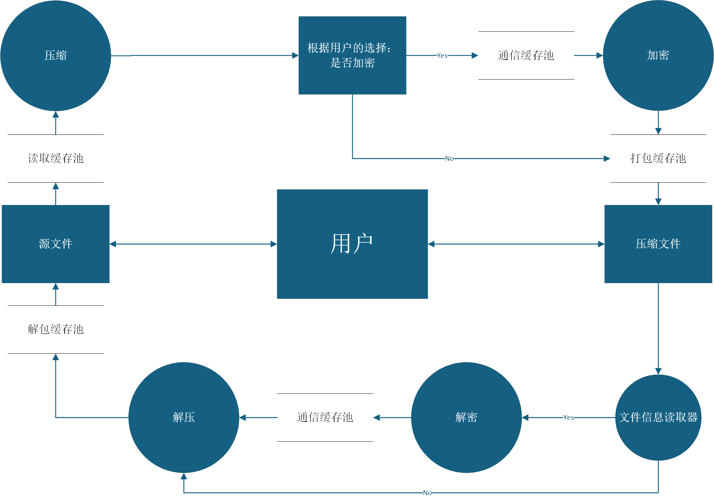
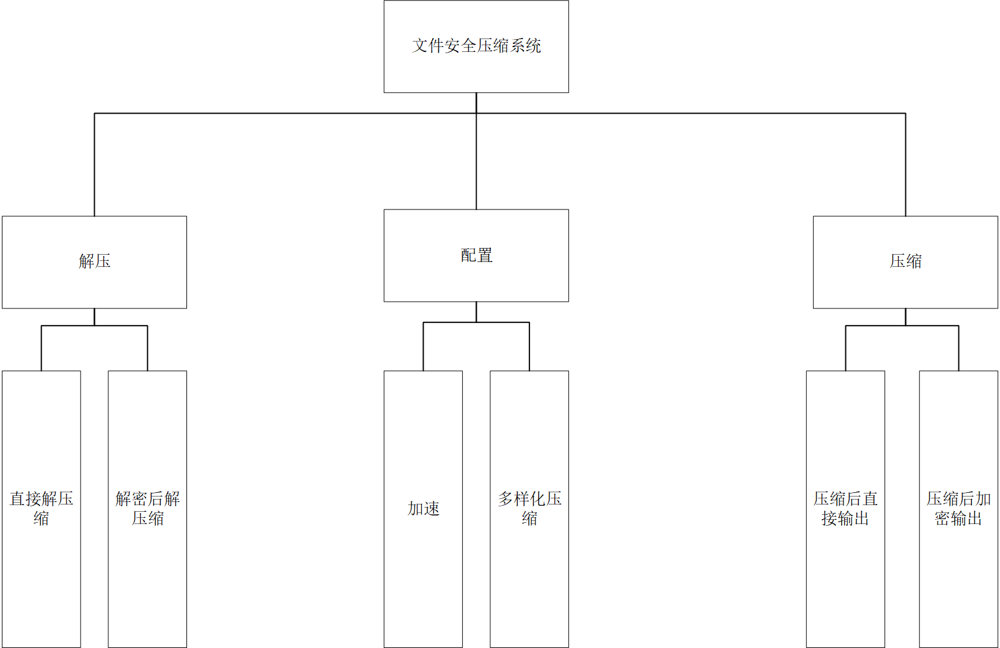
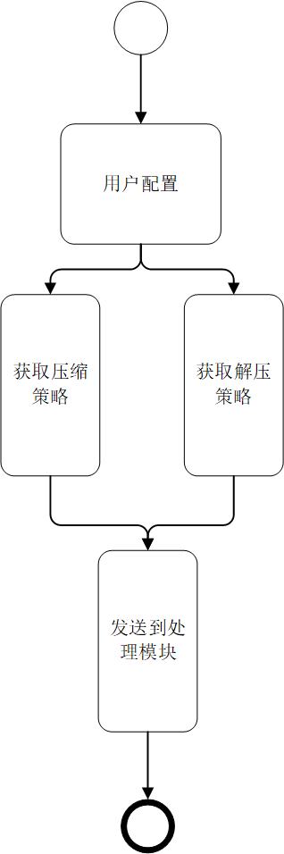
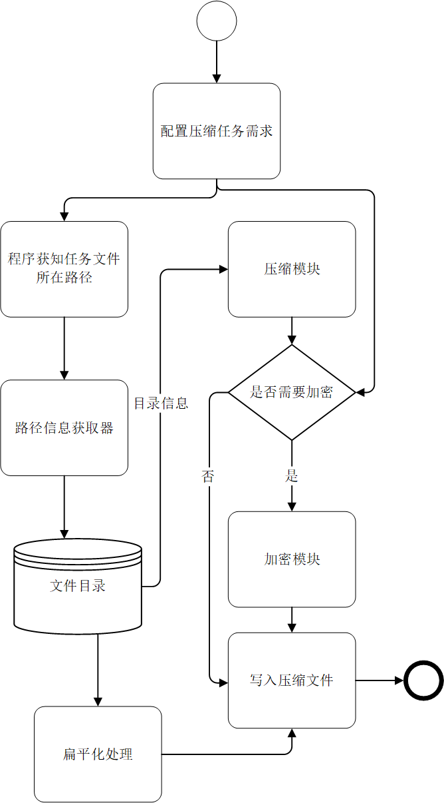
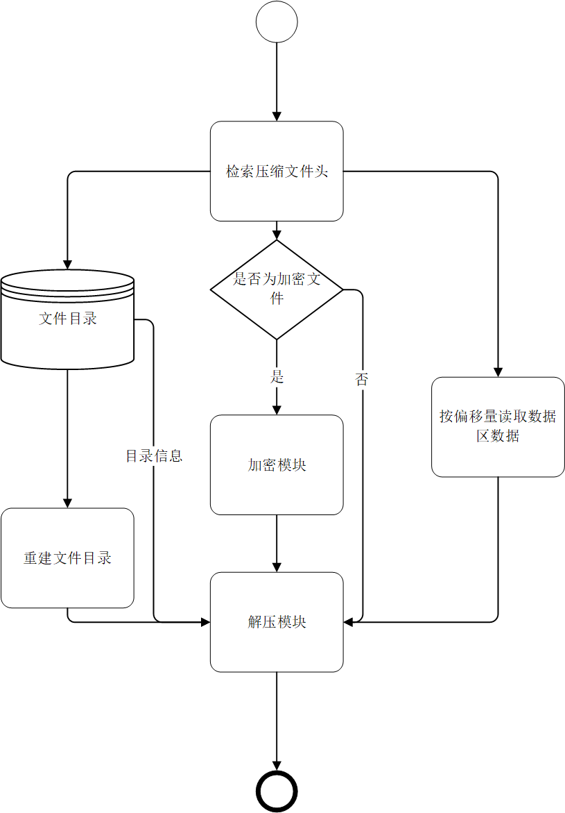

# 目录

- [目录](#目录)
- [1. 用户视角的应用](#1-用户视角的应用)
- [2. 程序概览](#2-程序概览)
- [3. 程序结构初步设计](#3-程序结构初步设计)
  - [3.1 程序结构及要点](#31-程序结构及要点)
  - [3.2 初步设计](#32-初步设计)
- [4. 底层细节与技术](#4-底层细节与技术)
  - [4.1 技术整合与分析](#41-技术整合与分析)
  - [4.2 关键技术点](#42-关键技术点)
- [5. 算法具体实现](#5-算法具体实现)
  - [5.1 实现方案](#51-实现方案)
  - [5.2 疑难问题](#52-疑难问题)
  - [5.3 优化与改进](#53-优化与改进)
- [6. 安全问题](#6-安全问题)
  - [6.1 Aes 的安全性问题](#61-aes-的安全性性问题)
  - [6.2 数据完整性问题](#62-数据完整性问题)
  - [6.3 系统安全考虑](#63-系统安全考虑)
- [7. 最终实现](#7-最终实现)
  - [7.1 程序的运行流程](#71-程序的运行流程)
  - [7.2 压缩实现详解](#72-压缩实现详解)
  - [7.3 解压实现详解](#73-解压实现详解)
  - [7.4 核心类实现](#74-核心类实现)
- [流程图](#流程图)
  - [SFC 数据流图](#sfc-数据流图)
  - [SFC 结构图](#sfc-结构图)
  - [SFC 流程图](#sfc-流程图)

# 1. 用户视角的应用

> 应用需要什么功能？

我们需要尽可能给用户提供自由的压缩选项。

【问题 A1】  
是否需要加密？用什么算法加密？这在 GUI 界面中分别通过一个勾选器和列表选择器让用户操作。

**实际实现**：当前版本使用 AES-128 加密，通过命令行输入密码。用户输入任意长度密码，程序使用 SHA-256 哈希后取前 16 字节作为密钥。

【问题 A2】  
在压缩时，可能需要处理多个文件一起压缩的情况。将多个文件整合成一个压缩包？所有文件分别独立成一个压缩包？或是在应用内可选择分类生成多个压缩包？需要提供一个选项供用户选择。

**实际实现**：支持多文件/目录一起压缩到单个 .sy 文件。通过命令行依次输入路径，输入 `done` 完成添加。

【问题 A3】  
~~对于编码结构，用户可以选择是否将其独立成一个文件存放。~~（已不纳入考虑）

【问题 A4】  
使用 RSA 加密可以实现特定用户间的数据加密传输。这时需要提供一个 RSA 密钥生成器。

**实际实现**：暂未实现 RSA，保留为未来功能。当前使用对称加密 AES-128。

【问题 A5】  
可以选择从右键菜单栏中直接启动压缩任务。

**实际实现**：暂未实现 GUI，当前为纯 CLI 程序。

# 2. 程序概览

技术名词解释：

- **AES 加密**：高级加密标准，对称性加密算法。本程序使用 AES-128，128bit 密钥，10轮处理。
- **RSA 加密**：非对称性加密算法。（备选，未实现）
- **流加密**：逐字节加密处理。（备选，未实现）
- **Huffman 编码**：基于前缀码的无损压缩算法。基于自然语言重复性实现压缩。
- **BWT 编码**：基于后缀数组的压缩数据预处理算法。（备选，未实现）
- **LZ77**：使用滑动窗口建立三元组的压缩算法，可作为 Huffman 压缩的前置操作。（备选，未实现）
- **Qt**：C++ 的 GUI 框架，跨平台兼容。（备选，未实现）
- **文件头**：包含压缩文件基本信息的数据结构。
- **位图(bitmap)**：按位存储状态。
- **信号与槽**：Qt 框架的核心思想，响应式 GUI 编程。
- **锁**：控制临界区的变量，持有锁的线程可以进入临界区。
- **条件变量**：核心为休眠队列，通过信号唤醒队列中的线程。
- **信号量**：类似 Minecraft 的红石比较器，或 AE 的发信器。控制进入临界区线程的数量。
- **死锁**：多个线程争抢锁的形式构成单向环图的状况。造成线程永久的休眠。
- **系统调用**：由操作系统提供给应用程序的接口。通常是受限操作，由操作系统执行。

# 3. 程序结构初步设计

## 3.1 程序结构及要点

**Compress/Decompress_System**（已实现）

- 负责压缩与解压。
- 核心类：`CompressionLoop`、`DecompressionLoop`
- 调用 Huffman 模块和 AES 模块

**Encryption/Decryption_System**（已实现）

- 负责加密与解密工作。
- 核心类：`Aes`
- 支持 SHA-256 密钥派生

**BufferPool**（部分实现）

- 缓存以上两者的输出（通信缓存池、打包缓存池、解包缓存池）
- 充当可接受线程管理器动态调度的对象
- 每个线程组独立使用一个缓存池
- 加入大小限制和溢出处理机制
- 充当接收输入并缓存/主动抛出的作用

**实际实现**：使用 `Y_flib::DataBlock`（底层为 `std::vector<uint8_t>`）作为数据块类型，通过函数参数传递实现数据流通。

**ErrorCollector**（未实现）

- 负责对错误的检测与收集，生成并且输出相关错误报告(日志)
- 当前使用 `std::runtime_error` 抛出异常，由主程序捕获

## 3.2 初步设计

### Encryption 加密模块设计

技术点(适配技术)：

1. **密钥 hash 处理**（已实现）
   
   用户输入任意长度的密码后，程序调用 SHA-256 算法对密码进行哈希处理，生成 32 字节的哈希值，然后取前 16 字节作为 AES-128 的实际密钥。这样做的好处是支持任意长度密码，同时保证密钥长度符合 AES 要求。

2. **尾部补全与去除**（已实现）
   
   AES 是分组加密算法，要求输入数据长度必须是 16 字节的整数倍。程序采用 PKCS#7 填充方案，在加密前自动计算需要的填充字节数并添加填充，解密后自动识别并去除填充。

3. **缓存池**（已实现）
   
   使用 `Y_flib::DataBlock` 作为数据缓冲，这是一个动态数组，可以自动扩展和管理内存。

### Compression 压缩模块设计

1. **频率统计**（已实现）
   
   遍历数据块中的每个字节，统计 0-255 各个字节值出现的次数。程序支持多线程分别统计不同数据块，最后合并统计结果。

2. **树构建**（已实现）
   
   使用最小堆（优先队列）数据结构，每次从堆中取出频率最小的两个节点，合并为一个新节点，新节点的频率为两者之和。重复此过程直到只剩一个节点，即为 Huffman 树的根节点。

3. **编码解码**（已实现）
   
   编码过程：从根节点开始递归遍历 Huffman 树，向左走记录 0，向右走记录 1，到达叶子节点时即得到该字符的编码。
   
   解码过程：从根节点开始，按编码位（0 或 1）在树上行走，到达叶子节点时输出对应字符，然后回到根节点继续处理下一个编码。

### UnitManager 单元管理器

- 示意：Huffman-(1)>Aes-(2)>.sy 文件(实际为二进制)
- 虚拟接口类的设计：

**实际实现**：通过 `CompressionLoop` 和 `DecompressionLoop` 类实现，直接调用 Huffman 和 AES 模块，采用顺序处理方式而非流水线。

### BufferPool 缓存池设计

- **依赖以下四种缓存方案实现程序的几乎所有数据流通：**

  1. **通信缓存池**：压缩与加密端之间的通信。

  2. **打包缓存池**：打包压缩单独输出、压缩加密输出（利用文件头区分。可能分别设计两类接口）

  3. **解包缓存池**：直接由 UnitManager 控制目录的收发，打包时将目录存放到文件头，配合文件分割标志（是一个经过读取缓存池方法转换后，赋给数据块对象的变量的 bool 类型变量值）来用于此处的目录还原。

  4. **读取缓存池**：读取目录并传输至打包缓存池。读取文件后：为压缩模块发送数据块、为解压模块发送数据。
     使用四个字节的滑动窗口动态检测魔数，遇到魔数则更改操作状态（要求魔数总是成对出现）

**实际实现**：使用 `DataLoader`、`DataExporter` 类实现数据读写，内部使用 8MB 固定大小缓冲区，通过函数调用传递数据，而非异步队列。

### 文件模块设计

1. **状态检测器**：检测加密状态（Y/N）。监控文件压缩进度。

   **实际实现**：通过 `Header.strategy` 字段判断是否加密。当前策略号为 0，后续可扩展不同压缩/加密组合。

2. **文件信息读取器**：将文件的整个文件头读取到程序缓存中，并进行相关检查。监控文件解压进度。

   **实际实现**：`BinaryStandardLoader` 类负责读取和解析文件头及目录块。

- 关于数据块类：

**实际定义**：`Y_flib::DataBlock` 是 `std::vector<unsigned char>` 的类型别名，利用 vector 的自动内存管理能力，无需手动分配和释放内存。

设计阶段定义（未完全实现）：
```
  vector<uint8_t> data    // 数据（二进制），可以先给定一个基础大小，避免频繁扩容
  uint32_t sequence_tag   // 顺序标签
  bool is_terminated      // 终止信号
  uint8_t header_flags    // 文件头标志位
  string source_tag       // 来源标签（如"COMPRESS", "AES"）
  string error_message    // 错误信息
```

- **偏移量记录方式和相关规则**

  - 维护：在文件头中存储数据文件的文件名初始大小，解压时逐步递减，直至字节数不足。
  - 另外，需要在压缩时动态维护已压缩文件的大小，待数据块抛出进程结束信号时写入文件头中预留好的偏移量的数据上，可以用于多文件下的 huffman 与 aes 的部分功能实现

**实际实现**：
- `DirectoryOffsetSize` 定义为 `uint64_t`，支持大文件
- `Header` 结构体包含魔数、策略、版本、头部偏移、目录偏移等字段
- 偏移量在写入过程中动态维护，最后回填到预留位置

### GUI 模块设计

1. 多线程模式选择(后续自动检测)
2. 加密、压缩算法切换
3. 引入已加密的标记与加密文件的自动识别、提示输入密码
4. 询问用户是否替换（跳过）冲突文件

**实际实现**：暂未实现 GUI，当前为 CLI 程序。冲突文件处理已实现：解压时检测文件是否存在，存在则输出警告并跳过，不会覆盖已有文件。

### Optimization 优化设计

- **Aes**
  1. 多线程：可能使用文件分割，需要注意内存和线程数检测
  2. 需要引入 id 标记分块文件，以便整合为文件输出
  3. 指令集加速(aes 提速、huffman 提速、LZ77 提速)

- **Huffman**
  1. 多线程，部分同 Aes

- **BufferPool**
  1. 多线程流水线
  2. 防溢出

- **ThreadManager**
  - 管理模块（分割文件并分配，需要传输各自的组合顺序标签）
  - 后续会拥有独立的多线程打包缓存池，负责打包各个打包缓存池的数据
  - 多线程流水线：具体来说 使用一一对应的生产者-消费者构建数个流水线，并且运用双缓冲技术赋予上下游异步读写的能力，实现提速和上下游模块的解耦。 可以多线程地使用多条流水线。（后续可以使用环形缓冲区进一步优化上下游之间的数据流）

**实际实现**：ThreadPool、Scheduler 等模块已在代码库中预留，但未在主程序中使用。当前为单线程顺序处理。

# 4. 底层细节与技术

## 4.1 技术整合与分析

主要技术：

- **加密：**
  - aes-128
- **压缩：**
  - huffman
- **控制：**
  - thread/buffer
- **文件**
  - .sy

分析：

- **加密：**
  - aes-128：128bit 密钥，十轮处理。

- **压缩：**
  - huffman：基于自然语言重复性的压缩算法

- **控制：**
  - thread/buffer:
    - 线程与线程、模块与缓存池之间的组合与调度

- **文件格式设计：**

```
      -------Magic------4B
      [文件头]
      ├─[Flags]  |1B压缩方案||1B软件版本号|
      |          └─程序存储一个方案表，不同方案在此处对应一定的数值
      |
      ├─[文件头偏移量1B][目录表偏移量8B]
      └─------Magic------

      [目录信息]
      ├─ |偏移量|
      │  |目录块|
      ├─ |偏移量|
      │  |目录块|
      └─------Magic------

      [数据区]
      ├─ |偏移量|
      │  |数据块|
      │
      ├─ |偏移量|
      |  |数据块|
      └─------Magic------
```

**实际实现**：

每个数据块都具有 Huffman 编码表，且在数据区的末尾添加了一字节标识符，以区分 Huffman 填充与有效数据。

实际文件结构（文件头部分）：

| 字段 | 大小 | 说明 |
|------|------|------|
| magicNum_1 | 4字节 | 魔数 0xDEADBEEF |
| strategy | 1字节 | 压缩策略号 |
| version | 1字节 | 版本号 |
| headerOffset | 1字节 | 文件头偏移 |
| directoryOffset | 8字节 | 目录块偏移 |
| magicNum_2 | 4字节 | 魔数 0xDEADBEEF |

可借鉴 7z 的扩展设计：

```
      [ 文件头 (固定16字节) ]
      ├─ Magic:         0x2E 0x73 0x79 0x1A (".sy\x1A")
      ├─ Version:       0x01 0x00 (小端)
      ├─ Flags:         0xC5 (二进制 11000101)
      │                  11000101
      │                  ││││││└─ 保留位
      │                  │││││└── 含文件属性
      │                  ││││└─── 含时间戳
      │                  │││└──── 分块文件
      │                  ││└───── 多文件包
      │                  │└────── 使用压缩
      │                  └─────── 已加密
      └─ Header CRC:    0x78 0x56 0x34 0x12

      [ 扩展头（可变长度） ]
      ├─ [压缩头]
      │  ├─ AlgorithmID: 0x01 (Huffman=0x01,LZMA=0x02)
      │  └─ DictSize:    0x00 0x40 0x00 0x00 (16MB)
      │
      ├─ [加密头]
      │  ├─ Method:      0x02 (AES-256-CBC)
      │  ├─ KDFIterLog:  0x10 (迭代次数=2^16)
      │  ├─ SaltSize:    0x10
      │  └─ Salt:        16字节随机值
      │
      ├─ [文件清单]
      │  ├─ FileCount    0x02 0x00 (2个文件)
      │  ├─ [FileMeta1]  结构体含文件名
      │  └─ [FileMeta2]
      │
      ├─ [分块信息]
      │  ├─ BlockCount:  0x03 0x00 0x00 0x00
      │  └─ BlockSizes:  [8字节×3]
      │
      └─ HeaderEndMark: 0xFF 0xFF

      [ 数据区 ]
      ├─ [块1]
      │  ├─ CompressedSize:   8字节
      │  ├─ OriginalSize:     8字节
      │  └─ Data:             N字节密文
      ├─ [块2]...
      └─ [块n]
```

## 4.2 关键技术点

### 模块间通信机制设计

**实际实现**：
- 使用数据块 `Y_flib::DataBlock` 作为传递载体，本质是字节向量的封装
- 通过函数参数传递实现模块间通信，采用同步调用方式
- 使用标准库队列 `std::queue` 管理待处理的文件和目录条目
- `BinaryStandardLoader` 内部维护三个队列：
  - `fileQueue`：待压缩/解压的文件队列
  - `entryQueue`：目录条目队列
  - `directoryQueue_ready`：解压时已就绪待创建的目录路径队列

### 缓冲区数据同步方案

**实际实现**：
- 每个模块独立使用缓冲区，不存在共享内存
- 通过函数调用同步，一个模块处理完成后将数据传递给下一个模块
- 数据块通过 `std::vector` 自动管理内存，处理完成后调用 `clear()` 释放
- 不使用锁机制，因为是单线程顺序处理

### 加密压缩的顺序化处理

**实际实现**：

压缩流程（每个 8MB 数据块）：
1. 统计字节频率 → 构建频率表
2. 构建 Huffman 树 → 生成编码表
3. 序列化 Huffman 树 → 转为字节流
4. AES 加密树数据 → 写入文件
5. Huffman 编码原始数据 → 转为压缩数据
6. AES 加密压缩数据 → 写入文件

解压流程（逆过程）：
1. AES 解密 Huffman 树数据 → 恢复树结构
2. 反序列化重建 Huffman 树
3. AES 解密压缩数据
4. Huffman 解码 → 恢复原始数据

### 异常处理和恢复机制

**实际实现**：
- 使用 C++ 异常机制，通过 `throw std::runtime_error()` 抛出异常
- 在主循环中使用 `try-catch` 捕获异常，防止程序崩溃
- 错误信息包含详细上下文：
  - 出错的函数名和操作
  - 相关文件路径和路径长度
  - 可能的原因提示（如权限、路径过长、文件被锁定等）
- 异常发生时，已打开的文件流会在对象析构时自动关闭

# 5. 算法具体实现

## 5.1 实现方案

### AES 加密实现

- **PKCS#7 填充方案**（已实现）
  
  程序在加密前计算输入数据长度除以 16 的余数，得到需要填充的字节数。例如，如果数据有 13 字节，则需要填充 3 字节，每个填充字节的值都设为 3。解密时读取最后一个字节的值，就知道需要去除多少填充。

- **密钥派生函数处理用户密码**（已实现）
  
  用户可能输入任意长度的密码，从几个字符到几百个字符不等。程序调用 SHA-256 哈希函数将任意长度输入转换为 32 字节的固定输出，然后取前 16 字节作为 AES-128 的密钥。这保证了密钥长度正确，同时提供了良好的密码混淆。

- **密钥扩展**（已实现）
  
  AES-128 需要 10 轮加密，每轮使用不同的轮密钥。程序通过密钥扩展算法从初始的 128 位密钥生成 44 个 32 位字（共 1408 位），这些轮密钥依次用于初始轮密钥加和后续 10 轮加密的 AddRoundKey 步骤。

- **10 轮加密过程**（已实现）
  
  每轮加密包含四个步骤（最后一轮省略 MixColumns）：
  - **SubBytes**：使用 S 盒进行字节替换，实现非线性变换
  - **ShiftRows**：循环移位各行，打乱列相关性
  - **MixColumns**：在 GF(2^8) 域上进行矩阵乘法，实现扩散
  - **AddRoundKey**：与轮密钥异或

- **GF(2^8) 乘法优化**（已实现）
  
  MixColumns 步骤需要在有限域上进行乘法运算。程序预先计算了乘 2、乘 3、乘 9、乘 11、乘 13、乘 14 的完整查找表（每表 256 项），加密时直接查表而非实时计算，显著提升性能。

### Huffman 压缩实现

- **基于频率统计的编码**（已实现）
  
  遍历数据块中的每个字节，在频率表中对应位置递增计数。频率表是一个 256 元素的数组，索引 0-255 对应字节值，存储的是该字节出现的次数。

- **树构建**（已实现）
  
  使用最小堆（优先队列）作为核心数据结构。首先将所有出现过的字节（频率 > 0）作为叶子节点加入堆中，按频率排序。然后循环执行：取出堆顶两个节点（频率最小），创建新节点作为它们的父节点，新节点频率为两者之和，将新节点放回堆中。重复直到堆中只剩一个节点，即为 Huffman 树的根。

- **编码生成**（已实现）
  
  从根节点开始递归遍历 Huffman 树。每次向左子树走，在编码序列后追加 0；向右子树走，追加 1。到达叶子节点时，记录该字符对应的完整编码。编码存储在哈希表中，键是字节值，值是编码序列和编码长度。

- **编码表序列化**（已实现）
  
  为了解压时能重建 Huffman 树，需要将树结构写入文件。采用前序遍历序列化：遇到内部节点写入字符 'r'，遇到叶子节点写入字符 'l' 后跟该节点的字节值。这种格式可以唯一确定树结构，解压时按前序遍历重建即可。

- **编码表反序列化**（已实现）
  
  读取序列化的树数据，采用递归方式重建：读到 'l' 表示叶子节点，读取后跟的字节值创建叶子；读到 'r' 表示内部节点，递归构建左子树和右子树。

- **单字符特殊情况处理**（已实现）
  
  当数据块只包含一种字符时，Huffman 树只有一个节点。此时常规的左右分支编码不适用。程序检测这种情况后，直接将该字符编码设为单个的 "0"，并在解压时特殊处理。

### 文件头实现

1. 记录文件头和数据块的偏移量

2. 记录压缩方案：加密方式/有无加密、压缩方式。

3. 在文件头记录文件的目录结构、偏移量：其中目录结构使用前缀索引（将会在前缀记录所有文件目录，其对应数据区存储包含文件后缀的文件名）、偏移量单独在文件名后存储（为每个节点预留 2\*8 字节，分别存储文件压缩前后大小）

4. 对于动态获取的偏移量的实时存储（接到结束信号后将压缩偏移量从缓冲区写入文件）。

   **实际实现**：
   - 方案：读取文件目录之后直接在文件头中逐个处理对应文件（服务于数据偏移量更新），并且在预留好的位置修改压缩后大小。（不影响数据区写入数据。）
   - 至此，实现无临时文件的方案已经完善。

5. **文件头信息写入**

   - 实现细则：

   - 1. 文件信息存储标准：|文件标|4B 文件名大小偏移量|文件名|----|

     - 文件标为字符 `'0'`：为目录。需要写入：|4B 第一级文件数量|
     
     - 文件标为字符 `'1'`：为文件。需要写入：|8B 原文件大小|8B 压缩后偏移位|。其中压缩大小暂时作为占位区。

     - 文件标为字符 `'2'`：为分割偏移量,是为加密/分块特化的标签
       - 写入:|1B 标识符||8B 偏移量||16B iv 加密头|
       - 如果读到偏移量为零，说明此时已经写入到最后一个不足 8MB 的块（按目录的残余偏移量来读取，包含只有一块的情况）aes 的加密头会写入到预留位置
     
     - 文件标为字符 `'3'`: 为逻辑根目录标记，与普通目录存储仅有标识符不同
     
     - 文件标识符为 `'4'`：为符号链接（已实现 Writer 端，Loader 端预留 Linux 实现）
       - 存储标准： |文件标|4B 文件名大小偏移量|文件名|4B 目标路径偏移量|目标路径|

**实际实现**：

使用枚举类型 `FlagType` 定义文件标准标识符：
- `Directory = '0'`：普通目录
- `File = '1'`：普通文件
- `Separated = '2'`：数据块分割标志
- `LogicalRoot = '3'`：逻辑根目录
- `SymbolLink = '4'`：符号链接

各文件标准的基础大小（不含变长文件名）：
- 文件标准：1 + 4 + 8 + 8 = 21 字节（标志 + 文件名长度 + 原始大小 + 压缩大小）
- 目录标准：1 + 4 + 4 = 9 字节（标志 + 目录名长度 + 子元素数量）
- 分割标准：1 + 8 + 16 = 25 字节（标志 + 块大小 + IV）

### 压缩前运行流程

- 0. 文件头开始与结束均需要写入魔数 `0xDEADBEEF`。

- 1. 目录：读取后写入对应的存储标准，并且在缓冲区中缓存一个文件数量。

- 2. 文件：读取后写入对应的存储标准

- 3. 搜索方案：采用 BFS。在上述 0、1、2 作为必要操作的条件下，搜索目录。

  I:

  - 如果搜索到文件：直接写入。
  - 如果搜索到目录：进入该目录并且记录其中第二级文件数量以及该目录的完整路径到队列备用。并且按标准写入文件。

  II:记录完数量后：返回，继续搜索第一级目录,重复操作 I,直到第一级搜索完成。

  III:处理队列，接着按照队列已存储的路径打开下一级目录，以先前获取的第二级文件数量及其所在目录的路径，按顺序读写对应的文件数据，直至文件数量 num--耗尽为止。

  IV：重复上述操作直到读取完成。

  以上 I~III 解决了解压文件时如何按照顺序读取文件及其目录的问题。

  V:特别地，可以为目标文件提供一个逻辑根目录（同名或命名），以便始终遵循如上顺序读写数据（或者单独存储根目录下的子文件/目录数量）。

  VI:文件头开始为写入文件头偏移量预留位置，文件头写入完毕后更新这个偏移量

  VII:如果需要加密，则按照偏移量在原内容上进行覆写

**实际实现**：

`EntryProcessor` 类实现了 BFS 目录扫描。流程如下：
1. 创建逻辑根节点，统计用户输入的文件/目录总数
2. 将用户指定的路径加入处理队列
3. 循环从队列取出目录，扫描其中的文件和子目录
4. 遇到文件：写入文件标准（标志、文件名、大小占位）
5. 遇到子目录：写入目录标准，将子目录路径加入队列
6. 每写入一定量的目录数据（16KB），插入一个分割标准

偏移量的读取和使用：

- 使用 `<fstream>` 的 `tellg()`、`tellp()` / `seekg()`、`seekp()`。
- 具体来说：
  - 在接到该文件读取完成信号之后，需要在文件头对应的偏移回填大小。

- **实际实现优化**：由于文件流存在缓冲，`tellg()` 和 `tellp()` 的返回值可能有延迟。因此在软件层维护一个 `tempOffset` 变量，每次写入数据后手动累加写入的字节数，保证偏移量准确。

### 文件头信息获取

1. **通用部分**：
   - I: 打开文件直接读取魔数，并且按照文件头方案读取策略等数据，如文件头以及文件目录的偏移量
   - II: 定位到文件目录起始位置，根据分隔符将文件目录信息按块读进内存中处理
   - III: 读取完 文件信息/压缩后数据 之后，记录此处的偏移量以便下一次处理时直接定位（往返定位）

2. **压缩时的信息获取**：
   - 在完成通用部分的基础上：
   - 需要获取并且拼接文件的路径，通过某种传输方式发送给压缩模块处理。
   - 需要在获取到数据块结束标志时写入末尾偏移量（统一以当前文件大小存储，并且在循环中更新下一次起始位置为上一次末尾偏移量）
   - 加密时确保数据块一次性处理完之后再交予写入程序写入文件中，预计更换 aes 为 cfb 模式的实现（已实现）

3. **普通解压时的信息获取**：
   - 在完成通用部分的基础上：
   - I:对于文件：获取其在数据区的偏移量并且定位到数据区对应的位置读取数据
   - II:对于文件夹：获取它携带的子文件数量信息并且记录到"下一层文件数量"，同时创建文件夹以及其 details 信息类对象，并将对象存入到队列中备用
   - III:按照以上方式读取数据直到耗尽当前目录的"文件数量"（根目录以及多文件根目录的边界情况：使用了加入逻辑根节点的方式解决）
   - IV:循环以上操作，并且注意比对此时的读取位置与文件头中记录的文件目录偏移量。

4. **解压时数据获取**：
   - 对于被加密的数据块：按偏移量分割，分块读取数据，解密后存储在内存中（需要专门编写一种新的读取函数，不过逻辑是类似的）
   - 加密后的目录需要被读取到内存后经过解密处理传回文件处理模块使用
   - 内存中保留拼接好的路径，抛弃已处理完的文件目录数据（动态数组采用默认 9KB 大小，实际上最多只能读到 8KB+600B 左右,配合 clear 恢复 size=0，还需要 resize 确保空间可写入）对于超大文件名，目前暂时没有设计解决方案，初步设想：维护一个回退偏移量管理这种边界问题

5. **压缩/解压时路径拼接细则**：
   - 读到文件标 0-目录进队等待处理（存完整路径），读到文件标 1-文件，按当前路径拼接并且交予数据加载模块。
   - 遍历完第一层一个目录记录的"子文件数量"后。继续处理队列中的目录，此时可能是第一层目录，也可能开启了第二层循环。
   - 逻辑根目录需要在压缩时忽略
   - 路径（原始、压缩输出路径）：要在 gui 层新增把 vector 传输给 HeaderLoader 模块的接口，不只是传给 HeaderWriter。以 std::filesystem::path 传输

**实际实现**：

`BinaryStandardLoader` 类的 `headerLoaderIterator` 方法实现了目录块的读取和解析：
1. 打开 .sy 文件，读取文件头，验证魔数
2. 定位到目录偏移量指定的位置
3. 循环读取分割标准，获取每个目录块的大小
4. 如果 IV 非全零，说明目录块已加密，调用 AES 解密
5. 将解密后的二进制数据传给 `EntryParser` 解析
6. 解析结果填充到文件队列和目录队列中

## 5.2 疑难问题

### 大数据处理

- **设想的解决方案**：引入分块处理机制

- **实际实现**：
  - 数据块大小：8MB（`BUFFER_SIZE` 常量）
  - 目录缓冲：16KB（`HEADER_BUFFER_SIZE` 常量）
  - 每个 8MB 数据块独立生成 Huffman 树，互不影响
  - 内存峰值稳定在约 64MB：包括一个 8MB 数据块、一个 8MB 输出缓冲、一个 16KB 目录缓冲、以及 Huffman 树和编码表

### 性能瓶颈

- **设想的解决方案**：动态调整线程池大小

- **当前状态**：ThreadPool 模块已在代码库中实现（包含命名线程、任务队列、条件变量等待等功能），但未在主程序中使用。当前为单线程顺序处理，性能瓶颈主要在：
  - Huffman 频率统计和编码：需要遍历数据两次
  - AES 加解密：软件实现，未使用硬件加速
  - 文件 I/O：大量小文件时磁盘寻址开销大

### 内存管理

- **设想的解决方案**：限制缓冲区最大尺寸

- **实际实现**：
  - 使用固定的 8MB 缓冲区，数据块通过 `std::vector` 管理
  - 每个数据块处理完后调用 `clear()` 释放内存，让 vector 的容量保持不变但 size 归零，避免频繁内存分配
  - 不使用动态扩容策略，内存使用量可预测

### 已修复的 Bugs

1. **目录块分块问题** - 大于或等于 16KB 则会在区块边界与文件信息恰好对齐时出现空文件 bug
   - （平均 36 字节每条信息，16KB 每块，能容纳约 450 个文件或目录条目）
   - **修复方案**：修改分割条件判断逻辑，在写入分割标准前检查当前缓冲区是否真正有数据需要分割，避免写入空的分割块

2. **文件已存在时的跳过问题** - 未能正确跳过文件，会清空已存在的文件内容
   - **修复方案**：在 `createFile` 函数中，创建文件前先检查目标路径是否存在。如果存在，输出警告信息并直接返回，不进行任何操作

3. **默认地址显示错误问题**
   - **修复方案**：统一使用 `std::filesystem::path` 处理所有路径，利用其 `is_absolute()` 和 `parent_path()` 方法正确计算相对路径和绝对路径

4. **Huffman 单字符问题** - 数据块只包含一种字符时树构建失败
   - **问题原因**：当数据块中所有字节都相同时，最小堆中只有一个节点，无法进行"取出两个最小节点合并"的操作
   - **修复方案**：构建 Huffman 树后，检查叶子节点数量。如果只有一个叶子节点，说明是单字符情况，直接将该字符的编码设为单个的 "0"，解压时也相应特殊处理

5. **长路径问题** - Windows 默认路径长度限制 260 字符
   - **问题原因**：Windows API 默认限制路径长度为 MAX_PATH（260 字符），超过此长度的路径无法正常打开
   - **修复方案**：在 `PathTransfer::transPath` 函数中，对于绝对路径，在前面添加 `\\?\` 前缀，告诉 Windows API 使用扩展长度路径模式，支持最长约 32000 字符的路径

6. **LTO 编译问题** - 启用链接时优化后程序异常
   - **问题原因**：LTO 会进行跨编译单元的优化，可能导致某些模板函数或内联函数被错误优化掉
   - **修复方案**：在编译选项中仅使用 `-O3` 优化，显式禁用 LTO（`-fno-lto`）。文档中已注明禁止启用 LTO

## 5.3 优化与改进

### 性能优化

- **SIMD 指令加速**（未实现）
  - AES-NI：现代 CPU 内置的 AES 加速指令集，可以将 AES 加密速度提升 5-10 倍
  - AVX2：可用于加速 Huffman 编码中的位操作和频率统计中的字节计数

- **加密、压缩等的多线程加速**（预留）
  - ThreadPool 模块已实现，支持命名线程和任务队列
  - Scheduler 模块已预留接口，支持策略模式和工作器模式
  - 可实现多个数据块并行压缩，然后按顺序写入

- **内存映射读取文件**（未实现）
  - 使用 `mmap`（Linux）或 `CreateFileMapping`（Windows）将文件映射到内存地址空间
  - 好处：减少数据拷贝，操作系统自动处理分页，简化大文件读取代码

### 功能扩展

- **支持多种加密算法**（未实现）
  - 当前仅支持 AES-128
  - 可扩展支持 AES-256（更安全）、ChaCha20（在移动设备上更快）等

- **增加压缩算法选择**（未实现）
  - 当前仅支持 Huffman
  - 可扩展支持 LZ77（更适合文本）、LZMA（压缩率更高）等
  - 可在文件头的策略字段中记录使用的算法组合

### 用户体验

- **进度显示优化**
  - 当前仅显示简单百分比：`Processing file: filename\n45.67%`
  - 可改进：显示已处理字节数/总字节数、估计剩余时间、当前处理速度

- **错误信息友好化**（已实现）
  - 详细错误信息包含：
    - 出错的类名和函数名
    - 相关文件路径和路径长度
    - 可能的原因提示（如"路径过长(>260字符)"、"权限被拒绝"、"文件被锁定"）

# 6. 安全问题

## 6.1 Aes 的安全性问题

### 密钥管理方案设计

**实际实现**：
- 用户输入任意长度密码
- 使用 SHA-256 哈希，取前 16 字节作为密钥
- 密钥存储在 `Aes` 类的私有成员 `aes_key_16bytes` 中
- 程序结束时（`Aes` 对象析构时），使用 `memset` 将密钥清零，防止内存残留

### 加密模式选择分析

**当前实现**：ECB 模式（简化实现）

ECB 模式的特点：每个 16 字节块独立加密，相同明文块产生相同密文块。

**问题**：
- 如果数据中有大量重复的 16 字节序列，密文中会出现明显的模式
- 攻击者可以通过分析密文模式推断明文特征
- 对于已知明文结构的文件（如特定格式的文档），安全性较低

**改进方向**：改为 CBC 或 CFB 模式

CBC 模式原理：
1. 每个明文块先与前一个密文块异或，再进行 AES 加密
2. 第一个明文块与初始化向量（IV）异或
3. IV 应该是随机生成的，并在加密数据前传输

**当前预留**：
- 已定义 `IvSize` 类型（16 字节数组）
- 分割标准中已包含 IV 字段（16 字节）
- 后续只需修改 AES 模块实现即可切换到 CBC 模式

## 6.2 数据完整性问题

### 校验和机制

**当前状态**：未实现

**问题**：
- 如果加密数据在传输或存储过程中被篡改，解密时可能产生乱码或程序崩溃
- 无法验证解压后的数据是否与原始数据一致

**改进方向**：
- 在文件头添加 CRC32（快速）或 SHA-256（安全）校验和
- 可在 Header 结构体的保留位中存储
- 解压完成后重新计算校验和，与存储值比对

### 防篡改设计

**当前状态**：未实现

**问题**：
- 攻击者可以修改密文，解密后产生非预期的明文
- 无法检测数据是否被篡改

**改进方向**：
- 使用 HMAC（哈希消息认证码）：对密文计算 HMAC，解密前先验证
- 或使用 AEAD 模式（如 AES-GCM）：同时提供加密和完整性验证

## 6.3 系统安全考虑

### 内存敏感数据清理

**已实现**：
- AES 密钥在 `Aes` 析构函数中被清零
- 使用标准库 `memset` 函数覆盖内存

**注意事项**：
- 现代 C++ 编译器可能会优化掉看似无用的 `memset` 调用
- 更安全的做法是使用操作系统提供的安全内存清理函数（如 Windows 的 `SecureZeroMemory`）

### 临时文件安全处理

**当前状态**：不使用临时文件，所有处理在内存中完成

**优势**：
- 避免临时文件被其他程序读取
- 避免程序崩溃后临时文件残留
- 减少磁盘 I/O，提升性能

### 权限最小化原则

**当前状态**：仅请求必要的文件读写权限

**已实现的安全措施**：
- 不请求网络访问权限
- 不请求管理员权限
- 不修改系统配置
- 不读取无关的文件

# 7. 最终实现

## 7.1 程序的运行流程

1. 用户通过 CLI 选择操作模式(压缩/解压)
2. 选择输入文件和输出路径
3. 输入必要参数(如密码)
4. 初始化处理模块 (HeaderWriter/HeaderLoader, Heffman, Aes)
5. 文件分块进入处理流水线
6. 加密/压缩顺序处理
7. 结果写入输出文件
8. 错误处理和日志记录
9. 内存清理和资源释放

**实际实现细节**：

程序入口在 `main.cpp`，流程如下：

**压缩模式**：
1. 显示操作菜单，用户输入 `1` 选择压缩
2. 循环提示用户输入要压缩的文件/目录路径，直到用户输入 `done`
3. 提示用户指定输出目录和输出文件名
4. 提示用户输入加密密码
5. 创建 `Aes` 对象，传入密码（内部会进行 SHA-256 哈希和密钥扩展）
6. 创建 `CompressionLoop` 对象，传入输出文件路径
7. 调用 `compressionLoop` 方法，传入文件路径列表和 AES 对象
8. 压缩完成后，程序退出

**解压模式**：
1. 显示操作菜单，用户输入 `2` 选择解压
2. 提示用户输入 .sy 文件路径
3. 提示用户指定输出目录（默认为 .sy 文件所在目录）
4. 提示用户输入解密密码
5. 创建 `Aes` 对象
6. 创建 `DecompressionLoop` 对象
7. 调用 `decompressionLoop` 方法
8. 解压完成后，程序退出

## 7.2 压缩实现详解

1. 跳过逻辑根，但是要获取数目
2. 从 GUI 获得一个路径 vector。获取尾端目录/文件名-用于验证文件目录已经正确写入，验证通过后直接使用路径入队处理
3. 从预备压缩文件中读取一个 vector 目录块并解析信息
4. 主循环：
   - I:读取目录块中的信息
   - II:读取到文件则拼接后读取数据块并传给处理模块（需要把整个文件的数据完整传输两次，第一次构建编码树，第二次真处理，分别写两个函数，其一适配构建编码树这个特殊需求）,结束时对当前工作目录的 count--（依赖处理模块传回的结束信息）
   - III:读取到目录则拼接后存其 details 到队列备用，结束时对当前工作目录的 count--
   - count 减小到零后把目录 details 弹出
   - IV:按策略处理数据块，而后写入压缩文件，注意加密需要写入 iv 头
   - 当前文件的循环结束： 末尾按照分割标准分割写入一个编码表，并且回填 vector 中的偏移量（偏移位置已保存）
   - 启动下一个文件/目录的处理，如果 vector 目录块已经处理完，则再读取目录块
   - 外层循环：按策略处理 vector 目录块（加密），而后覆写在原位置减去 iv 头长度的位置上
   - 加密相关：文件目录和编码表，如果有加密，则是仅加密，不压缩的

**实际实现**：

`CompressionLoop::compressionLoop` 方法实现了压缩主流程：

**第一阶段：目录序列化**
1. 创建 `HeaderWriter` 对象
2. 调用 `headerWriter` 方法，内部：
   - `writeHeader`：写入文件头（魔数、策略、版本、偏移量占位）
   - `EntryProcessor::entryProcessor`：BFS 扫描目录，写入文件/目录标准
   - 每处理 16KB 目录数据，插入一个分割标准
3. 此时目录信息已写入文件，但尚未加密

**第二阶段：数据压缩**
1. 创建 `BinaryStandardLoader` 对象，用于读取刚才写入的目录信息
2. 调用 `headerLoaderIterator` 方法，解析目录信息，填充文件队列
3. 主循环：遍历文件队列
4. 对于每个文件：
   - 创建 `DataLoader` 对象，按 8MB 分块读取文件内容
   - 循环处理每个数据块：
     - 调用 `Heffman::statistic_freq` 统计字节频率
     - 调用 `Heffman::gen_hefftree` 构建 Huffman 树
     - 调用 `Heffman::tree_to_plat_uchar` 序列化 Huffman 树
     - 调用 `Aes::doAes(1, ...)` 加密 Huffman 树
     - 调用 `DataExporter::exportCompressedData` 写入加密的树
     - 调用 `Heffman::encode` 编码原始数据
     - 调用 `Aes::doAes(1, ...)` 加密压缩数据
     - 调用 `DataExporter::exportCompressedData` 写入加密数据
   - 文件处理完成，调用 `DataExporter::thisFileIsDone` 回填偏移量

**第三阶段：目录加密**
1. 调用 `BinaryStandardLoader::encryptHeaderBlock` 方法
2. 定位到目录块起始位置
3. 读取目录块数据，调用 `Aes::doAes(1, ...)` 加密
4. 将加密后的数据覆写回原位置

## 7.3 解压缩实现详解

1. 获取文件头策略编号以及版本号，据此选择解压策略
2. 主循环：
   - 按偏移量逐个读取目录块，交由处理模块解密后回传，在内存中使用
   - 如果是目录：创建文件夹，并且入队其 details，按照队列的标准流程处理（同压缩实现过程）
   - 如果是文件：创建文件，读取压缩后，文件数据并且传给处理模块，回传后写入对应文件

**实际实现**：

`DecompressionLoop::decompressionLoop` 方法实现了解压主流程：

**第一阶段：读取文件头和目录**
1. 创建 `BinaryStandardLoader` 对象
2. 调用 `headerLoaderIterator` 方法：
   - 打开 .sy 文件，读取文件头
   - 验证魔数是否为 0xDEADBEEF
   - 定位到目录偏移量指定的位置
   - 循环读取分割标准，确定每个目录块的大小
   - 如果 IV 非全零，说明目录已加密，调用 `Aes::doAes(2, ...)` 解密
   - 将解密后的二进制数据传给 `EntryParser` 解析
   - 解析结果填充到 `fileQueue`（文件队列）和 `directoryQueue_ready`（待创建目录队列）

**第二阶段：创建目录结构**
1. 循环处理 `directoryQueue_ready` 队列
2. 对于每个目录路径：
   - 检查父目录是否存在，不存在则递归创建
   - 调用 `std::filesystem::create_directory` 创建目录

**第三阶段：恢复文件**
1. 主循环：处理 `fileQueue` 中的每个文件
2. 对于每个文件：
   - 调用 `createFile` 创建空文件（如果文件已存在则跳过）
   - 获取该文件在数据区的偏移量，定位到数据区
   - 循环处理该文件的所有数据块：
     - 读取分割标准
     - 读取 Huffman 树块大小和加密的树数据
     - 调用 `Aes::doAes(2, ...)` 解密 Huffman 树
     - 调用 `Heffman::spawn_tree` 从序列化数据重建 Huffman 树
     - 读取数据块大小和加密数据
     - 调用 `Aes::doAes(2, ...)` 解密数据
     - 调用 `Heffman::decode` Huffman 解码
     - 调用 `DataExporter::exportDecompressedData` 写入解压数据
   - 文件处理完成，更新数据偏移量

**边界情况处理**：
- 文件已存在：输出警告并跳过，不覆盖
- 目录不存在：自动创建父目录
- 大文件：分块处理，每块独立的 Huffman 树

## 7.4 核心类实现

### HeaderWriter

**职责**：写入文件头和目录结构

**主要方法**：
- `headerWriter`：主入口，协调整个写入流程
- `writeHeader`：写入文件头（魔数、策略、版本、偏移量占位）
- `writeDirectory`：调用 `EntryProcessor` 扫描目录并写入

**设计模式**：策略模式
- `HeaderWriter_Interface`：抽象接口
- `HeaderWriter_v0`：v0 版本的具体实现
- `HeaderWriter`：包装类，持有接口指针，支持运行时切换实现

### BinaryStandardLoader

**职责**：从 .sy 文件读取目录块，支持 AES 解密

**主要成员**：
- `fileQueue`：文件队列，存储待处理的文件条目
- `entryQueue`：目录条目队列
- `directoryQueue_ready`：解压时待创建的目录路径队列
- `blockPosition`：目录数据块位置数组，用于加密回填

**主要方法**：
- `headerLoaderIterator`：主读取循环，逐块读取、解密、解析目录结构
- `getDirectoryOffset`：获取目录块偏移量
- `allLoopIsDone`：检查是否完成所有读取
- `restartLoader`：重新打开文件并定位到当前偏移
- `encryptHeaderBlock`：压缩时加密目录块并回填

### DataLoader

**职责**：按块读取文件数据

**主要成员**：
- `data`：数据缓冲区
- `fileSize`：文件总大小
- `inFile`：输入文件流
- `loadIsDone`：读取完成标志
- `readed`：已读取字节数

**主要方法**：
- `getBlock`：获取当前缓冲区数据
- `isDone`：检查是否读取完成
- `reset`：重新打开指定文件
- `dataLoader`（无参）：按默认缓冲区大小读取
- `dataLoader`（有参）：按指定大小读取，用于解压流程

### DataExporter

**职责**：写入压缩/解压后的数据，支持偏移量回填

**主要成员**：
- `outFile`：可读写的文件流（使用 fstream 而非 ofstream，支持回填）
- `processedFileSize`：已处理数据总大小

**主要方法**：
- `getProcessedFileSize`：获取已处理数据总大小
- `thisFileIsDone`：更新当前文件的完成标记和位置
- `exportCompressedData`：写入压缩数据块
- `exportDecompressedData`：写入解压数据块

### Heffman

**职责**：Huffman 压缩核心算法

**主要成员**：
- `bytecount`：字节数统计
- `hashtab`：字符频率和编码表（哈希表）
- `treeroot`：Huffman 树根节点指针
- `pathStack`：遍历树时的路径栈

**压缩流程方法**：
- `statistic_freq`：统计字节频率
- `merge_ttabs`：合并多线程统计结果
- `gen_hefftree`：构建 Huffman 树
- `save_code_inTab`：生成编码表
- `encode`：编码数据
- `tree_to_plat_uchar`：序列化 Huffman 树

**解压流程方法**：
- `spawn_tree`：从序列化数据重建 Huffman 树
- `decode`：解码数据

### Aes

**职责**：AES-128 加密算法实现

**主要成员**：
- `w[44]`：44 个轮密钥字（由密钥扩展生成）
- `iv[16]`：初始化向量
- `aes_key_16bytes[16]`：128 位主密钥（哈希后的用户密码）
- 预计算表：`S`（加密用 S 盒）、`S2`（解密用逆 S 盒）、`GF_MUL_*`（GF(2^8) 乘法表）

**主要方法**：
- 构造函数：哈希用户密码、扩展密钥、初始化 IV
- 析构函数：安全清除内存中的密钥
- `doAes`：统一加密/解密接口（mode=1 加密，mode=2 解密）
- `aes`：10 轮加密核心
- `deAes`：10 轮解密核心
- `extendKey`：密钥扩展，生成 44 个轮密钥

# 流程图

## SFC 数据流图



## SFC 结构图



## SFC 流程图

- 配置模块: 
- 压缩模块: 
- 解压模块: 

---

*最后更新：2026-04-15*
